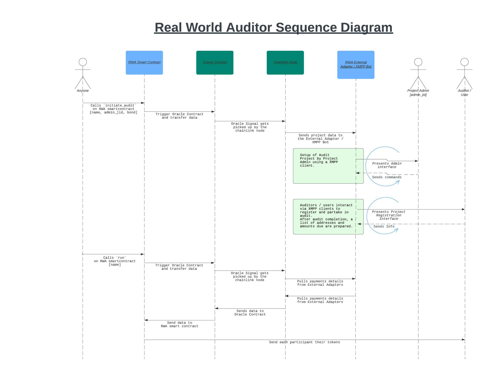

# Real Word Auditor

A tool to coordinate and incentivise a set of independent actors to assess a set of independent criteria, using Chain link and XMPP to link block chain payment rails to real world activity.
Actors are assigned randomly to various criterion, with each criterion having at least three actors assessing it.
The system rewards actors whose assessment aligns with that of the majority, and penalizes assessments that go against.
Once an assessor has registered on chain, all other interaction between the assessor and the system is done via XMPP (Instant messaging), using Chain link to bring the results back on chain to automatically execute payment.

This is the external adapter/bot that talks to the chainlink node, either receiving instruction to initiate an audit, or sending the settlement details back to be executed.

## 5 Minute overview of what it does
[](https://www.youtube.com/watch?v=VxIKy8hyWeo)

## Contracts
The contracts are here https://github.com/rogervs/RWA_contracts

## System Overview
[Sequence Diagram]()



## Install
1. Create a python virtual environment using something like `pyenv-virtualenv`
2. Install dependencies. `pip install -r requirements.txt`

## Run
`python rwa.py`

## Tips
TCPFlow is a program that shows you the TCP stream going in and out of a port.
`sudo tcpflow -c -i lo port 8080`

## On-chain Version
A proof of concept on-chain version was written first in Solidity. It can be found in the `rwa_poc_sol` directory.

## XMPP Servers
You should be able to use any public XMPP server, but I haven't tried. Some might have issues with you running bots, dunno.

For a locally hosted XMPP server, I've been using [Openfire](https://igniterealtime.org/projects/openfire/) . 
Seems to work fine. I've seen there's options to run clusters of these. I'd like to investigate what benefits that brings. If if brings fallover resilience, than each chainlink node could run a openfire node in that cluster bringing more resilience. Still an open question.

## XMPP Clients
These seem fine:
. [Dino](https://dino.im/)
. [Gajim](https://gajim.org/)

## Hackathon Entry
https://devpost.com/software/real-world-auditor

## Admin User Interface
Once a user starts a chat with the EA bot, and they have been assigned as the admin in an audit via the smartcontract, these commands will be available to them. Any input that is not recognised will result in this list of commands being printed. Some of them are not currently operational.

### Commands 
* `open` : Allows auditors to register
* `close` : Closes registration
* `start` : Start the audit 
* `stop` : Stop the audit 
* `state` : Returns the current state of the audit 
* `add <description>` : Adds an item to the audit 
* `items` : Returns the items in the audit 
* `del <number> :` Deletes item from the audit. <number> is obtained from `item list` 
* `set num_items <value> ` : Sets the number of items that need to be audited 
* `set num_audits_per_item <value> ` : Sets the number audits per item (needs to be an odd number) 
* `outstanding_inspections` : Returns the outstanding audits 
* ‎`set slashing_ratio <value>` : Sets the severity of the slash an auditor will receive for every incorrect observation 


## Audit States
Each audit is run as a state machine. The states are defined as:

``` python
class State(Enum):
    INITIALIZATION = 0
    AUDITOR_REGISTRATION = 1
    AUDITOR_REGISTRATION_COMPLETE = 2
    AUDITING = 3
    AUDITING_FINISHED = 4
    CALCULATED_ITEM_RESULTS = 5
    CALCULATED_AUDIT_RESULTS = 6
    CALCULATED_AUDITOR_RESULTS = 7
    WAITING_FOR_CONTRACT = 8
    COMPLETE = 9
```

#### `INITIALIZATION`
* This is the state the audit is in when it is initially created via the RWA smart contract via a Chainlink External Adapter. 
* Only the user with the `admin_jid` specified in the smartcontract can interact with the bot at this stage.
* Any input that is entered and not recognised by the system will result in the Menu commands being sent to the client.
* This is the phase during which the admin adds the tasks that they want done.
* Tasks are added using the `add <description>` command.
* Issuing the `open` commands transitions the state machine to the `AUDITOR_REGISTRATION` state.

#### `AUDITOR_REGISTRATION`
* Prospective auditors can apply to join the audit by sending the audit name to the bot.
* To link someone to an audit, all you need to send them is the bot's jid, which would be something like `task_master@mydomain.com`, and the name of projects, eg "Downtown Working Street Light Inspection"
* Once the admin is happy they have enough participants, they can issue the `close` command, which transitions the state of the bot to `AUDITOR_REGISTRATION_COMPLETE`

#### `AUDITOR_REGISTRATION_COMPLETE`
* A holding state until the time is right to initiate the audit.
* Issue the command `start` to transition the state to `AUDITING`.

#### `AUDITING`
* Auditors will be sent their next task.
* Auditors respond with either `True` or `False`, `y` or `n`, `yes` or `no`
* Once all the tasks have been performed, the admin can issue the `stop` command to transition the state to `AUDITING_FINISHED`


#### `AUDITING_FINISHED`, `CALCULATED_ITEM_RESULTS`, `CALCULATED_AUDIT_RESULTS`, `CALCULATED_AUDITOR_RESULTS`
* These states just go through various mathematical tasks and database tasks. 
* They have been split like this to try and keep it modular, so that different mechanisms can be slotted in, and or replaced.
* The average response for each item is calculated, which is then deemed to be the concensus.
* All auditors that aligned with the new assumed truth, get rewarded with the per task reward amount.
* All auditors that voted against the new assumed truth, they get slashed by a percentage of the value of the task. ie. They loose tokens.
* The state of the bot will automatically go to the state `WAITING_FOR_CONTRACT`


#### `WAITING_FOR_CONTRACT` 
* The External Adapter / bot is now presenting two arrays, one for addresses and one for amounts, corresponding to how much each auditor is owed on a http port.
* Any can execute the `run` function on the RWA smart contract with the name of the project.
* The smart contract will then call the oracle contract, which will trigger the Chainlink node to run a specific job, which in turn will connect to a bridge, which will then connect to the API that the External Adapter / Bot is presenting. The smart contract will then pay everyone the amount that they are owed.
* Once the data has been fetched, the system state is transitioned to `COMPLETE`

#### `COMPLETE`
* This is where the results of the audit are presented to the project admin, and the audit ends.
* Would be nice to add an option here that the results are automatically saved to IPFS.
